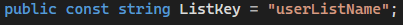

# Tutorial: Setup Redis Triggers for Azure Function in Visual Studio
Article 08/08/2023 Nadia Bugarin, Riley MacDonald, Phoebe Owusu

In this tutorial, you learn how to:
1. Install packages on an existing Azure function
1. Use a Redis trigger with your Azure Function
1. Deploy an Azure Function


## Prerequisites
- Accounts
    - Azure Redis Cache 
   - CosmosDB Account
- Completion of a previous Tutorial
    - [How to configure Azure Cache for Redis](https://learn.microsoft.com/en-us/azure/azure-cache-for-redis/cache-configure)
    - [Create an Azure Cosmos DB account, database, container, and items from the Azure portal](https://learn.microsoft.com/en-us/azure/cosmos-db/nosql/quickstart-portal)
        - Finish steps up to (and including), "Add a database and a container."
    - [Get started with Azure Functions triggers in Azure Cache for Redis](https://learn.microsoft.com/en-us/azure/azure-cache-for-redis/cache-tutorial-functions-getting-started)
        - Finish steps up to (and including), "Configure the cache."

- Sample code
    - ReadThrough
        - [PubSub.Sample](ReadThroughSamples/PubSubSample.cs)
        - [List.Sample](ReadThroughSamples/ListSample.cs)
    - WriteAround
        - [PubSub.Sample](WriteAroundSamples/PubSubSample.cs)
        - [List.Sample](WriteAroundSamples/ListSample.cs)
        - [Stream.Sample](WriteAroundSamples/StreamSample.cs)
    - WriteBehind
        - [PubSub.Sample](WriteBehindSamples/PubSubSample.cs)
        - [List.Sample](WriteBehindSamples/ListSample.cs)
        - [Stream.Sample](WriteBehindSamples/StreamSample.cs)
    - WriteThrough
        - [PubSub.Sample](WriteThroughSamples/PubSubSample.cs)
        - [Stream.Sample](WriteThroughSamples/StreamSample.cs)

## Installing Packages and adjusting variables

### Install packages and adding code
1. In the terminal, add the following packages
    1. dotnet add package Microsoft.Azure.Cosmos
    1. dotnet add package Microsoft.Azure.WebJobs.Extensions.CosmosDB
    1. dotnet add package Microsoft.Azure.WebJobs.Extensions.Redis --prerelease
    1. dotnet add package Microsoft.NET.Sdk.Functions
1. Choose a sample from the Prerequisites to use with your Azure Function according to each trigger and caching pattern.
1. Copy and paste the sample code into your azure function, using a cs file.

### Adding connection string and variables
1. Direct to your local.settings.json file in Visual Studio.
2. Copy and paste the following code as a replacement for your local.settings.json.
3. Replace each variable with the appropriate value.
 ```json
{
  "IsEncrypted": false,
  "Values": {
    "AzureWebJobsStorage": "UseDevelopmentStorage=true",
    "FUNCTIONS_WORKER_RUNTIME": "dotnet",
    // Database all of the functions can share
    "CosmosDbDatabaseId": "<database-id>",
    // Container for lists
    "ListCosmosDbContainerId": "<container-id-for-list>",
    // Container for key/value pairs set with PubSub triggers
    "PubSubCosmosDbContainerId": "<container-id-for-pubsub>",
    // Container for messages sent with PubSub triggers
    "MessagesCosmosDbContainerId": "<container-id-for-pubsub-messages>",
    // The name of the channel the PubSub trigger is listening to
    "PubSubChannel": "<pubsub-channel-name>",
    // Container IDs of the CosmosDB containers that store the stream messages
    "StreamCosmosDbContainerId": "<container-id-for-stream>",
    // Container IDs of the CosmosDB containers that store the stream messages when writing to a single document
    "StreamCosmosDbContainerIdSingleDocument": "<container-id-for-stream-singular-document>",
    // Name of the streams the trigger is listening to
    "StreamTest": "<stream-name>",
    // Name of the stream the trigger is listening when writing to a single document in CosmosDB
    "StreamTestSingleDocument": "<stream-name-singular-document>",
    // Primary connection string to Redis Cache
    "RedisConnectionString": "<cache-name>.redis.cache.windows.net:6380,password=<access-key>,ssl=True,abortConnect=False,tiebreaker=",
    // Account endpoint to CosmosDB
    "CosmosDbConnectionString": "AccountEndpoint=https://<cosmosdb-account>.documents.azure.com:443/;AccountKey=<access-key>;"
  }
}
 ```

* NOTE: each trigger should be using a separate container, which is dependent on the variable names.

### Adjusting List and Stream variables
Lists 
1.	WriteBehind
    - Change the value of ListKey to the desired key before the function 
2.	WriteAround 
    - Change the value of ListKey to the desired key before the function 
3. ReadThrough
    - Change the value of ListKey to the desired key before the function

    

### Security
* This design introduces new secrets. Theses secrets are the CosmosDB keys and connection strings, and the Azure Cache for Redis Connection strings. These will be stored in the customers’ storage account associated with their function app.

## Clean up resources

If you're not going to continue to use this application, delete
<resources> with the following steps:

1. From the homepage of the Azure Portal, navigate to the resource you want to delete
1. On overview, select Delete account or “Delete."
1. Confirm anything else to delete the resource


## Related content

> [README](README.md)

