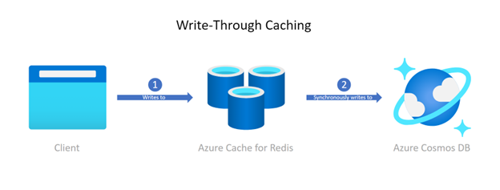
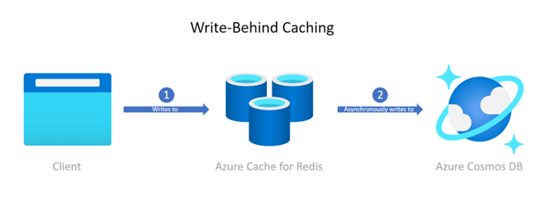
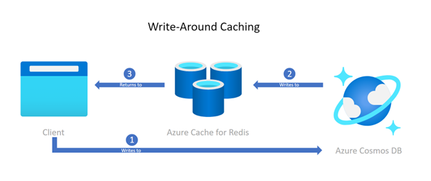
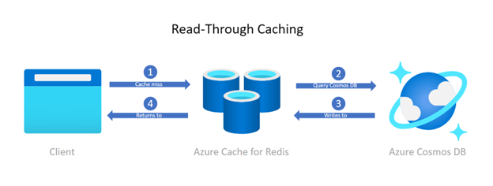

# Redis Triggers for Azure Functions
08/08/2023 Nadia Bugarin, Riley MacDonald, Phoebe Owusu

## Introduction
This project is an integration between Redis Cache and CosmosDB that includes function triggers using caching patterns that include Write Behind, Write Through, Write Around, and Read Through. Each function trigger, PubSub, Lists, and Streams.

## Prerequisites
- Accounts
   - Azure Redis Cache 
   - CosmosDB Account
- Visual Studo Code
    - Custom NuGet Package (available in this repo)
        * dotnet add package Microsoft.Azure.WebJobs.Extensions.Redis --prerelease

## Description of each caching pattern
1. WriteThrough: Write-through caching is a data caching strategy that ensures data modifications are immediately written to both the cache and database simultaneously. When data is updated in the system, the write operation I first directed to the cache. Write-through caching ensures that the changes are immediately propagated to the permanent storage.
    * Benefits: This approach offers strong data consistency, as the cached data and the actual data in the main memory or disk remain in sync at all times. Consequently, even if a system failure or crash occurs, there is minimal risk of data loss or corruption, as the most recent updates have been safely persisted in the permanent storage.
    * Limitations: Write-through caching might not provide the same level of read performance improvement as write-back caching, which allows for faster read operations by temporarily storing modified data in the cache without immediately writing it to the underlying storage. The trade-off with write-through caching lies in its reliability and data integrity, making it a preferred choice for applications where preserving data consistency is of paramount importance, such as databases and critical file systems.
    
    

2. WriteBehind: Write-behind caching is a data caching technique that operates in contrast to write-through caching. In this caching pattern, data modifications are initially written only to the cache, and the updates are asynchronously propagated to the database at a later time.
When data is modified in the system, the changes are first stored in the cache, providing a fast and responsive experience for write operations. The system acknowledges the write as complete once the data is safely in the cache, allowing the application to continue without waiting for the database write to complete. 
    * Benefits: Write-behind caching is commonly used in scenarios where write performance optimization is a priority, especially when dealing with non-critical data or applications that can tolerate a certain level of data loss in the event of a system failure. It is often employed in caching systems for file storage, web applications, and certain database applications to enhance write throughput and overall system responsiveness.
    * Limitations: Write-behind caching can provide performance benefits for write-heavy workloads, but its limitations regarding data consistency, data loss, increased complexity, and memory pressure must be carefully considered based on the specific requirements and characteristics of the application. For mission-critical systems and applications where data integrity is of utmost importance, alternative caching strategies such as write-through caching or write-around caching may be more suitable.
    
    

3. WriteAround: Write-around caching is a data caching technique that differs from write-through and write-back caching. With this strategy, data modifications are first written directly to the database and bypass the cache entirely. The write operation is acknowledged as complete once it is successfully stored in the permanent storage. When data is subsequently requested, the cache is checked first. If the data is not found in the cache (a cache miss), it is fetched from the underlying storage and, optionally, stored in the cache for potential future access.
    * Benefits: Write-around caching is particularly useful for large datasets or applications with significant write-heavy workloads. It can prevent the cache from being filled with transient or infrequently accessed data, optimizing cache space for frequently read data, and reducing cache eviction pressure.
    * Limitations: Write-around caching does have its own trade-offs, If data is accessed frequently right after being written, read latency may suffer due to the data not being initially cached. Additionally, there is still a possibility of increased read latency for less frequently accessed data, as it might not be cached at all.
    
    

4. ReadThrough: Read-through caching is a data caching technique that aims to improve read performance by reducing the latency associated with fetching data from the database. In this caching pattern, when a read request is made, the cache is the first point of access to check for the requested data. If the data is not found in the cache (a cache miss), the caching system automatically retrieves the data from the database and caches it for future use, which makes it accessible for the requesting application. 
    * Benefits: Read-through caching offers improved read latency by serving frequently accessed data directly from the cache, reducing retrieval time from the slower underlying storage. This enhances application responsiveness and is particularly beneficial for read-intensive workloads. Moreover, read-through caching simplifies application code by automatically handling data retrieval and caching, freeing developers from managing these complexities. The cache adapts to changing access patterns over time, continually optimizing read performance. Additionally, read-through caching helps distribute read traffic, alleviating the load on the underlying storage and contributing to a more efficient system. Overall, it is a valuable strategy for data-intensive applications that rely heavily on read operations. 
    * Limitations: Read-through caching may be inefficient for write-heavy workloads, leading to higher write latency. Limited cache size can result in frequent evictions, affecting less frequently accessed data. Data staleness issues may occur when frequent data changes are not immediately reflected in the cache. Using the read-through caching strategy requires careful consideration for invalidation strategies and eviction policies.
   
   

## Description of each Redis Trigger
1. PubSub: PubSub is a way for different programs to communicate with each other using messages. A publisher can send a message to a channel, and any number of subscribers listening to that channel can receive it. Pub/Sub uses a fire and forget message delivery system meaning that a message will be delivered once if at all. So, if a subscriber misses a message due to network error or some other issue, it will never receive it. You can read more about pubsub on the Redis docs
    1.	Write Through, Write Behind: Every time a key is set or changed, the information is stored in CosmosDB. The same is true for messages sent on a specified Pubsub channel.
    2.  Write Around: Data written to CosmosDB will then be stored in the cache for future read operations. This works for key-value pairs and pubsub channel-message data.
    3.	Read Through: When reading, first check if the data is in the cache. If the data is not found in the cache (a cache miss), the caching system automatically retrieves the data from the database and caches it for future use. This is only applicable for key-value pairs.
2. Lists: Redis Lists are linked lists that contain string values. They are typically used to implement stacks and queues, and to build queue management for background worker systems.
    1.	Every time an item is added to the cache, it is popped and sent to CosmosDB
3. Streams: A Redis Stream is a datatype that acts as an append only log. Streams are used for real time data consumption where a consumer is actively listening for messages published to a stream. Unlike pub/sub, when a consumer stops running, it can continue to read messages where it left off once it turns on again. The RedisStreamTrigger uses consumer groups to read new entries from a stream.
    1.	Every time a message is written to the stream, the RedisStreamTrigger will consume the message in real-time using write through or write behind caching patterns.
    2.	Write around can be used to write from CosmosDB to Redis

## Unsupported Functionality
1. PubSub:
    1. These triggers are only available on the Premium plan and Dedicated plan because Redis pub/sub requires clients to always be actively listening to receive all messages. There is a chance your function may miss messages on a consumption plan.
    2. Functions using these triggers should not be scaled out to multiple instances. Each instance will trigger on each message from the channel, resulting in duplicate processing.

2. Lists:
    1. Write Through was not implemented because of the popping nature of the trigger, which prevents any synchronous nature

3. Streams:
    1. Reading from a stream outside of reading in real-time is not supported with the RedisStreamTrigger. You can use the PubSubTrigger to detect if your stream has been deleted and refresh the the cache but that is the limit. 
    2. You cannot modify entries in a stream. For the Write Around function, a new message will have to be written with a new ID.
    3. If you follow the route where all messages are written in one CosmosDB document, anytime a change happens in the document, it’s not possible to detect where the change happened from in and you will need to re-write all entries again to the stream.
    4. If you follow the route where messages have their own document, it becomes difficult to monitor the size of storage

### Security
* This design introduces new secrets. Theses secrets are the CosmosDB keys and connection strings, and the Azure Cache for Redis Connection strings. These will be stored in the customers’ storage account associated with their function app.

